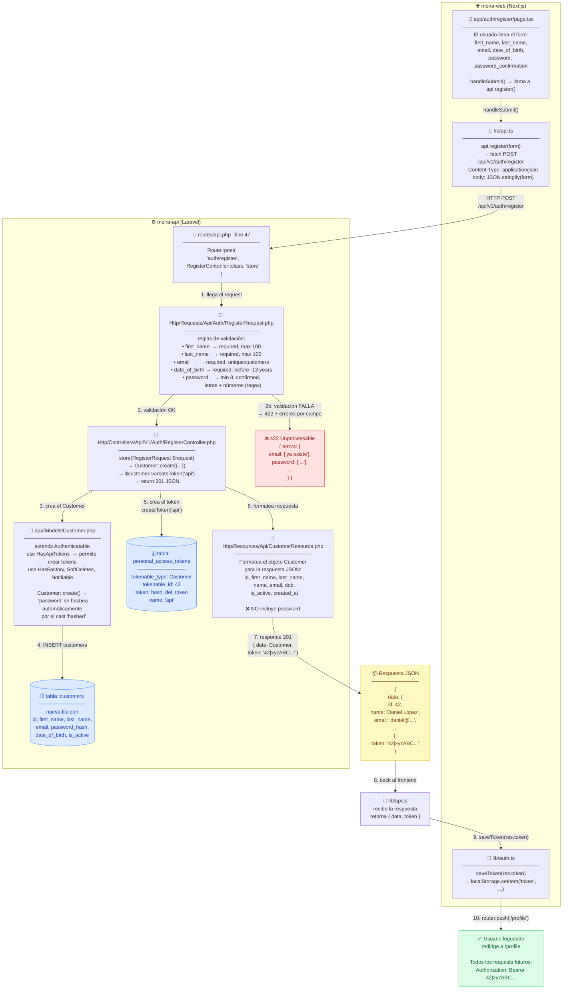
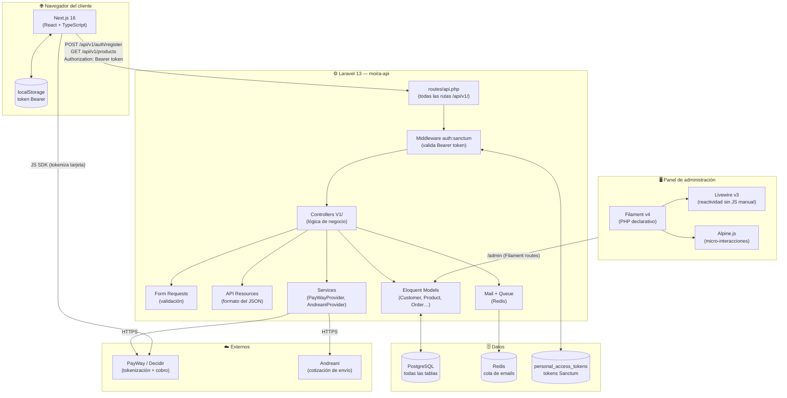
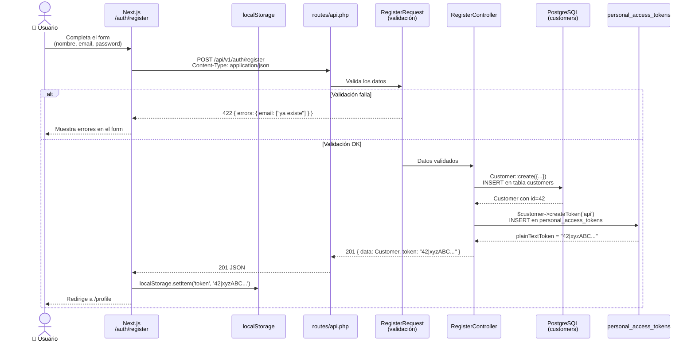
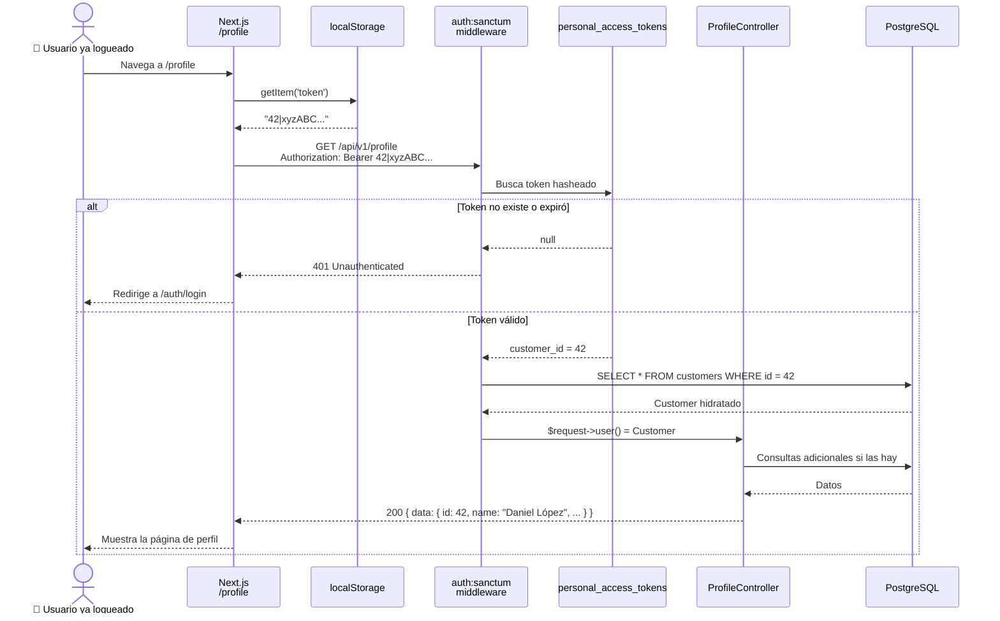
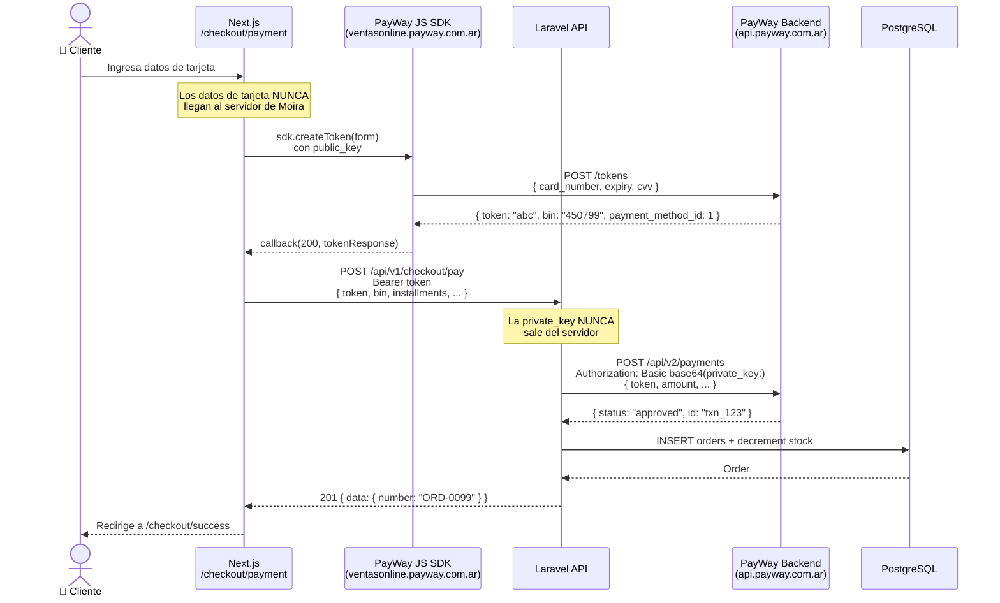
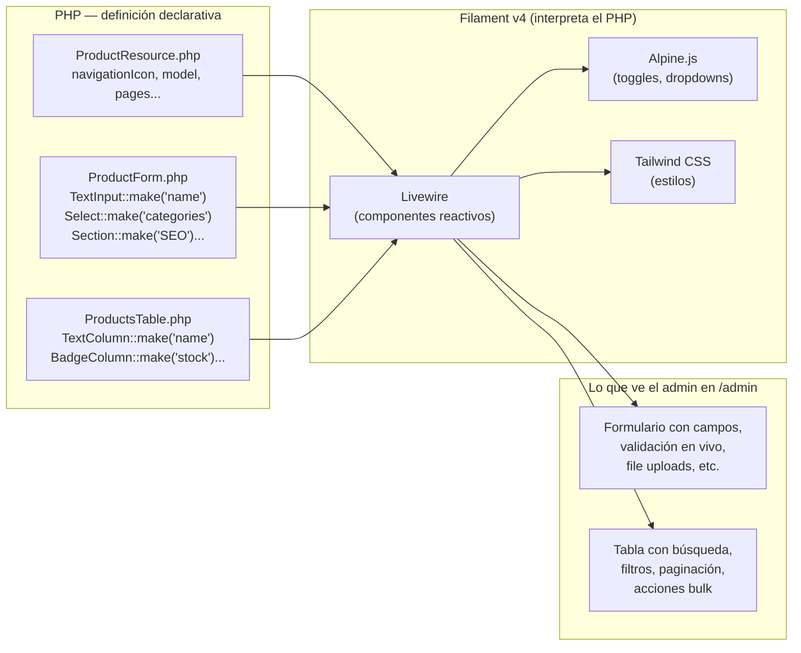
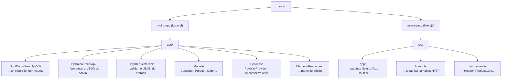

# Moira — Diagramas de arquitectura

---

## 0. Flujo completo: crear un Customer (archivo por archivo)

---

## 1. Arquitectura general

---

## 2. Flujo: registro de un nuevo cliente

---

## 3. Flujo: request autenticado (ej. ver perfil)

---

## 4. Flujo: checkout con pago con tarjeta

---

## 5. Cómo funciona Filament (panel admin)

---

## 6. Estructura de carpetas clave

